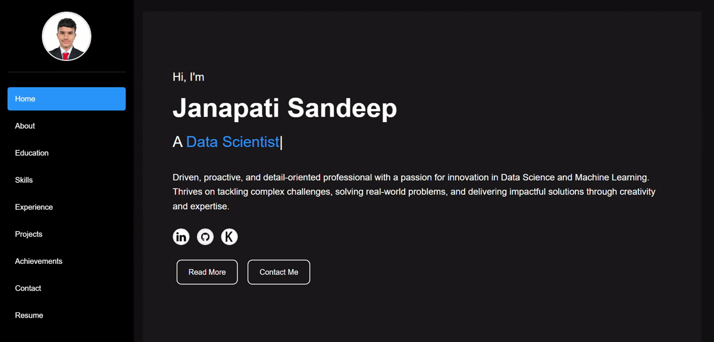

# Portfolio Website

Welcome to my personal portfolio website! This project showcases my skills, experiences, and academic journey in a professional and visually appealing manner.

Access the website using : https://sandeepjanapati.github.io/

## 🌟 Features
- **Home Section**: A brief introduction with my name and a dynamic typing effect to highlight my role.
- **About Section**: Highlights my professional traits and passions.
- **Education Section**: Details my academic background, including key coursework and achievements.
- **Skills Section**: Lists my technical expertise, including programming languages, frameworks, and tools.
- **Experience Section**: Provides insights into my professional experiences and internships.
- **Projects Section**: Highlights key projects, with links to repositories or live demos.
- **Achievements Section**: Lists notable accomplishments in my academic and professional journey.
- **Contact Section**: Displays my contact details for direct communication.
- **Resume Section**: Allows visitors to download a copy of my resume.

## 🛠️ Technologies Used
- **HTML5**: For structuring the content of the website.
- **CSS3**: For styling and layout customization.
- **JavaScript**: For adding interactivity and dynamic behavior.
- **Assets**: Includes images, icons, and downloadable resources.

## 🖼️ Preview

| Section    | Description                                        |
|------------|----------------------------------------------------|
| Home       | Introduces me with a dynamic typing effect and navigation options. |
| About      | Highlights my professional overview and traits.   |
| Education  | Lists my academic achievements and coursework.     |
| Skills     | Displays my technical expertise visually.          |
| Experience | Describes my internships and work experiences.     |
| Projects   | Showcases my key projects with relevant links.     |
| Contact    | Displays my email, LinkedIn, and other contact details. |
| Resume     | Provides a direct link to download my resume.      |

## 🧑‍💻 Author
**Janapati Sandeep**

- 📧 Email: [janapati.sandeep.min21@itbhu.ac.in](mailto:janapati.sandeep.min21@itbhu.ac.in)
- 🌐 LinkedIn Profile: [LinkedIn]([https://www.linkedin.com/in/your-profile-link](https://www.linkedin.com/in/sandeep-yadav-janapati-22337a239/))
- 🏛️ Address: IIT BHU, Varanasi, Uttar Pradesh, India

## 📝 License
This project is licensed under the MIT License.

Feel free to explore, modify, and share! 😊
